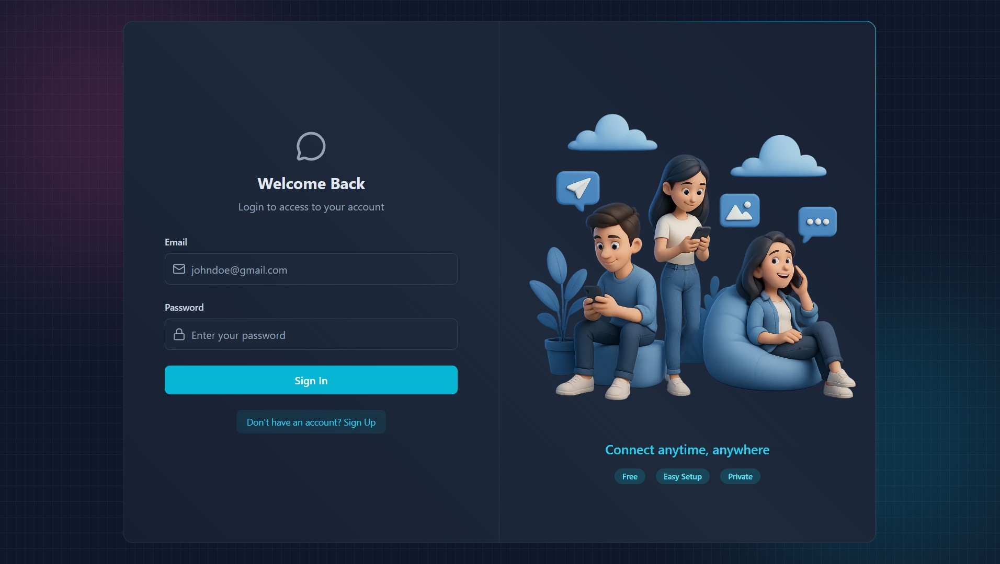
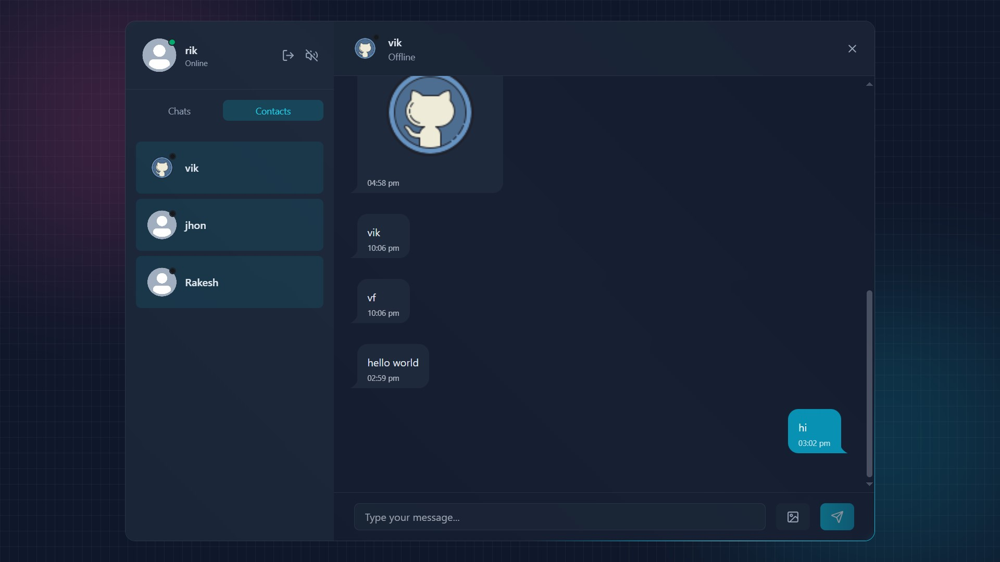

# Flash — A Clean, Fast Messaging App

**Flash** is a realtime messaging web application built with a modern stack: **React (Vite)** for the frontend, **Express** + **Node.js** for the backend, **MongoDB** for persistence, **Socket.IO** for realtime messaging, and **Tailwind CSS** for a beautiful, clean UI.

> Lightweight, responsive and focused on a delightful chat experience — sign up, log in, and exchange text and image messages in realtime.

---

## Demo / Preview

## Live Demo

🚀 [Try Flash Messaging App](https://flash-a-messaging-web-app-1zzjs.sevalla.app/)

Experience the app in action! Create an account or use the demo credentials.

#### Login Page
 

--- 
#### Chat Screen
 


## Key Features

- User authentication: **Sign up** and **Login** (JWT-based sessions)
- Protected against brute force attacks via Arcjet rate limiting - Bot protection and request shielding
- Realtime messaging using **Socket.IO** (one-to-one chat, group-chat-ready structure)
- Send and receive **text** and **image** messages (image uploads stored on server or cloud storage)
- Message history persisted in **MongoDB**
- Responsive, clean UI built with **Tailwind CSS**
- Online presence indicator
- Secure endpoints and basic input validation

---

## Tech Stack

- **Frontend:** React (Vite) + Tailwind CSS  
- **Backend:** Node.js + Express  
- **Realtime:** Socket.IO  
- **Database:** MongoDB (Atlas or self-hosted)  
- **Auth:** JSON Web Tokens (JWT)  
- **Image Upload** Cloudinary

---


---

## Getting Started — Local Development

### Prerequisites

- Node.js (v22+ recommended)
- npm or yarn
- MongoDB (local or Atlas)

### Environment variables

Create a `.env` file in the `backend` folder as well as in `frontend` folder

for `backend` .env

- PORT=5000
- MONGO_URI=""
- JWT_SECRET=your_jwt_secret
- JWT_EXPIRES_IN=7d

- FRONTEND_URL="http://localhost:5173"
- ResendAPIKey=""
- EMAIL_FROM=""
- EMAIL_FROM_NAME=""
- CLOUDINARY_CLOUD_NAME=""
- CLOUDINARY_API_KEY=""
- CLOUDINARY_API_SECRET=""
- ARCJET_KEY=""
- ARCJET_ENV=development

for `frontend` .env

- VITE_API_URL=""


## Install & Run (devlopment)

**Backend**


```bash
cd backend
npm install
npm run dev 
```


**Frontend**

```bash
cd frontend
npm install
npm run dev
```

